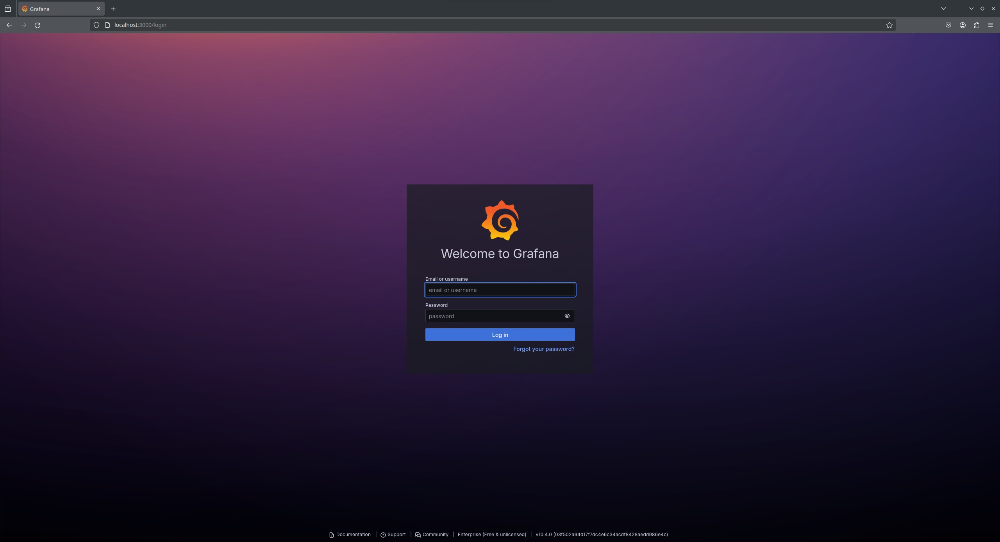
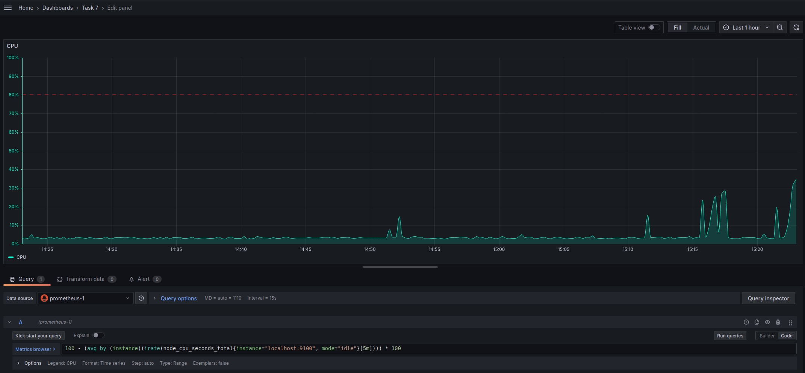

# Part 7. Prometheus и Grafana

**Установить и настроить Prometheus и Grafana на виртуальную машину**

## Установка Grafana

- Импортировать ключ GPG репозитория Grafana, выполнив следующую команду:

`sudo vim /etc/yum.repos.d/grafana.repo`  

>[grafana]
name=grafana
baseurl=https://rpm.grafana.com
repo_gpgcheck=1
enabled=1
gpgcheck=1
gpgkey=https://rpm.grafana.com/gpg.key
sslverify=1
sslcacert=/etc/pki/tls/certs/ca-bundle.crt

- После добавления репозитория можно установить Grafana:

`sudo dnf update`  
`sudo dnf install grafana`  

- После установки Grafana необходимо запустить службу Grafana для доступа к веб-интерфейсу:

`sudo systemctl enable grafana-server`  
`sudo systemctl start grafana-server`  

- Открыть порт в брандмауэре, чтобы получить доступ к Grafana с другого устройства:

`sudo firewall-cmd --add-port=3000/tcp --permanent`  
`sudo firewall-cmd --reload`  

## Установка Prometheus

- Загрузить инструмент Prometheus:

`wget https://github.com/prometheus/prometheus/releases/download/v2.37.0/prometheus-2.37.0.linux-amd64.tar.gz`  

- Извлечь файлы:

`tar -xf prometheus-2.37.0.linux-amd64.tar.gz && mv prometheus-2.37.0.linux-amd64 /etc/prometheus`  

- Создать отдельную учетную запись пользователя без входа в систему для Prometheus.

`useradd prometheus --shell=/bin/false --no-create-home`  

- Скопировать prometheus и promtool в /usr/local/bin и изменить право собственности на исполняемые файлы и каталог /etc/prometheus пользователя Prometheus:

`sudo cp -pr /etc/prometheus/promtool prometheus /usr/local/bin/`  
`sudo chown prometheus:prometheus /usr/local/bin/promtool`  
`sudo chown prometheus:prometheus /usr/local/bin/prometheus`  
`sudo chown -R prometheus:prometheus /etc/prometheus`  

- Создать каталог локального хранилищ, а также изменить владельца на Prometheus:

`sudo mkdir /var/lib/prometheus`  
`sudo chown -R prometheus:prometheus /var/lib/prometheus`  

- Создайть служебный файл для Prometheus и добавить в него приведенное ниже содержимое:

`sudo vim /etc/systemd/system/prometheus.service`  

>Description=Prometheus
Wants=network-online.target
After=network-online.target
User=prometheus
Group=prometheus
Type=simple
ExecStart=/usr/local/bin/prometheus \
--config.file /etc/prometheus/prometheus.yml \
--storage.tsdb.path /var/lib/prometheus/ \
--web.console.templates=/etc/prometheus/consoles \
--web.console.libraries=/etc/prometheus/console_libraries
WantedBy=multi-user.target

- Перезагрузить systemd и запустить службу Prometheus:

`sudo systemctl daemon-reload`  
`systemctl start prometheus`  
`systemctl enable prometheus`  

## Создание собственного dashboard'а

- Перейти на страницу Grafana http://localhost:3000:

- Перейти в раздел *Data sources* и нажать *Add data source*:

- В предложенном списке выбрать *Prometheus*:

- В настройка *URL* указать адрес *Prometheus'а* (http://localhost:9090):

- Сохранить изменения:

- Перейти в *Dashboard* и нажать *Add a new panel*:

- Добавить на dashboard Grafana отображение ЦПУ, доступной оперативной памяти, свободное место и кол-во операций ввода/вывода на жестком диске:

- Запустить bash-скрипт из **Части 2** и посмотреть на нагрузку жесткого диска (место на диске и операции чтения/записи):

- Установить утилиту stress:

`sudo dnf install stress`  

- Запустить команду stress и посмотреть на нагрузку жесткого диска, оперативной памяти и ЦПУ:

`stress -c 2 -i 1 -m 1 --vm-bytes 32M -t 60s`
