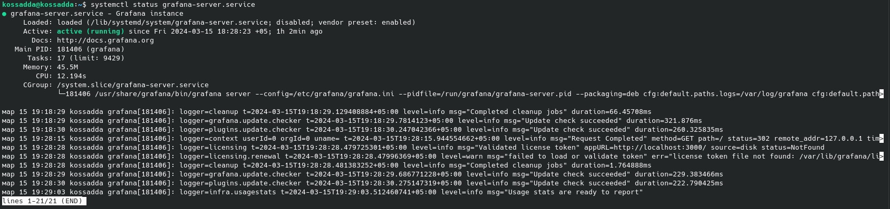
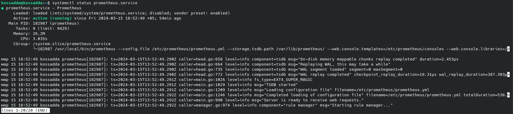
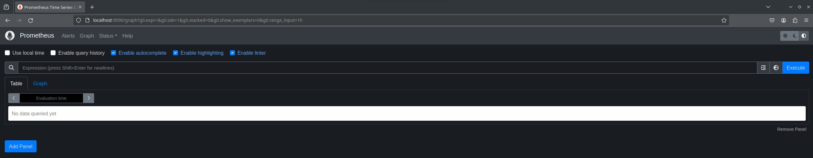
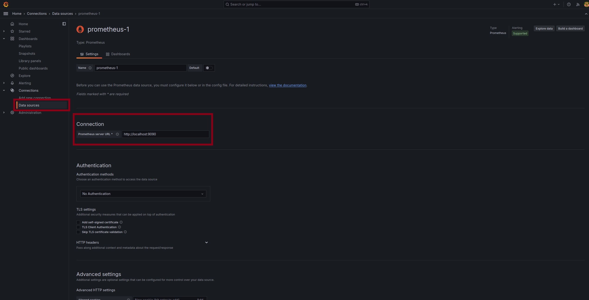
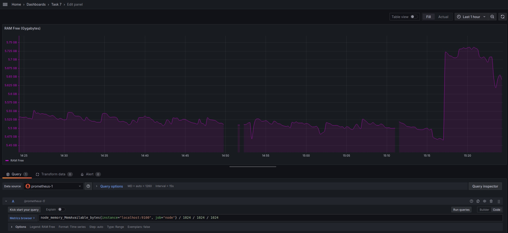
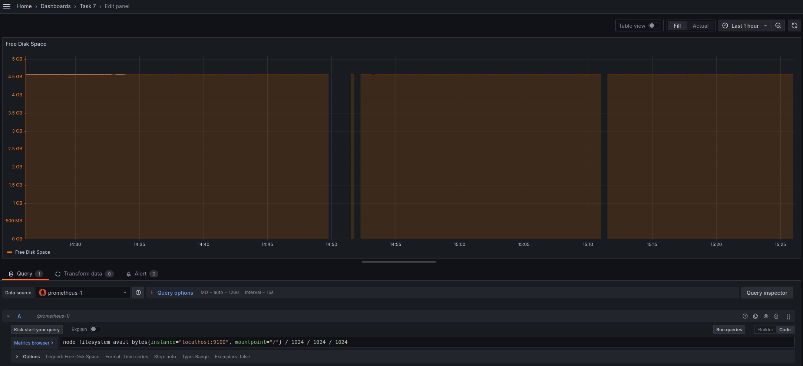

# Part 7. Prometheus и Grafana

**Установить и настроить Prometheus и Grafana на виртуальную машину**

## Установка Grafana

- Устанавить пакеты adduser, libfontconfig1 и musl в системе:  
`sudo apt-get install -y adduser libfontconfig1 musl`

- Загрузить инструмент grafana с официального сайта:  
`wget https://dl.grafana.com/enterprise/release/grafana-enterprise_10.4.0_amd64.deb`

- Установить загруженный пакет:  
`sudo dpkg -i grafana-enterprise_10.4.0_amd64.deb`

- Перезагрузить systemd и запустить службу Grafana:

`sudo systemctl daemon-reload`  
`systemctl start grafana-server.service`  
`systemctl status grafana-server.service`  

- Проверить работу порта:

## Установка Prometheus

- Загрузить инструмент Prometheus:

`wget https://github.com/prometheus/prometheus/releases/download/v2.37.0/prometheus-2.37.0.linux-amd64.tar.gz`  

- Извлечь файлы:

`tar -xf prometheus-2.37.0.linux-amd64.tar.gz && mv prometheus-2.37.0.linux-amd64 /etc/prometheus`  

- Создать отдельную учетную запись пользователя без входа в систему для Prometheus:

`useradd prometheus --shell=/bin/false --no-create-home`  

- Скопировать prometheus и promtool в /usr/local/bin и изменить право собственности на исполняемые файлы и каталог /etc/prometheus пользователя Prometheus:

`sudo cp -pr /etc/prometheus/promtool prometheus /usr/local/bin/`  
`sudo chown prometheus:prometheus /usr/local/bin/promtool`  
`sudo chown prometheus:prometheus /usr/local/bin/prometheus`  
`sudo chown -R prometheus:prometheus /etc/prometheus`  

- Создать каталог локального хранилищ, а также изменить владельца на Prometheus:

`sudo mkdir /var/lib/prometheus`  
`sudo chown -R prometheus:prometheus /var/lib/prometheus`  

- Создайть служебный файл для Prometheus и добавить в него приведенное ниже содержимое:

`sudo vim /etc/systemd/system/prometheus.service`  

>Description=Prometheus  
Wants=network-online.target  
After=network-online.target  
User=prometheus  
Group=prometheus  
Type=simple  
ExecStart=/usr/local/bin/prometheus \  
--config.file /etc/prometheus/prometheus.yml \  
--storage.tsdb.path /var/lib/prometheus/ \  
--web.console.templates=/etc/prometheus/consoles \  
--web.console.libraries=/etc/prometheus/console_libraries  
WantedBy=multi-user.target

- Перезагрузить systemd и запустить службу Prometheus:

`sudo systemctl daemon-reload`  
`systemctl start prometheus`  
`systemctl status prometheus`  

- Проверить работу порта:

## Создание собственного дашборда

- Перейти на страницу Grafana http://localhost:3000 (логин и пароль - admin):

- Перейти в раздел *Data sources* и нажать *Add data source*. В предложенном списке выбрать *Prometheus* и в настройках *URL* указать адрес *Prometheus'а* (http://localhost:9090):

- Сохранить изменения:

- Перейти в *Dashboards* и нажать *Create Dashboard*:

- Добавить на dashboard Grafana отображение CPU:

- Доступной оперативной памяти:

- Доступного свободного места:

- Количества операций ввода/вывода:

- Итоговый вид дашборда:

## Тестирование дашборда

**Запустить bash-скрипт из Части 2 и посмотреть на нагрузку жесткого диска (место на диске и операции чтения/записи)**

- Создание мусора:

- Очистка мусора:

- Установить утилиту stress:

`sudo apt install stress`  

- Запустить команду stress и посмотреть на нагрузку жесткого диска, оперативной памяти и ЦПУ:

`stress -c 2 -i 1 -m 1 --vm-bytes 32M -t 60s`  
