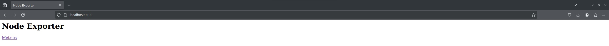
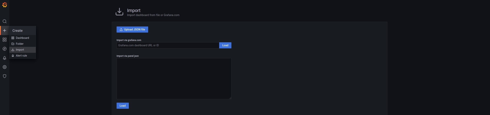
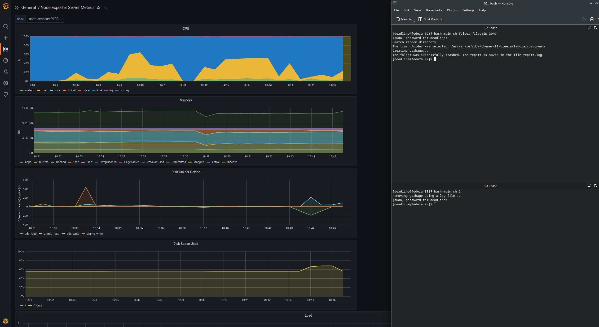
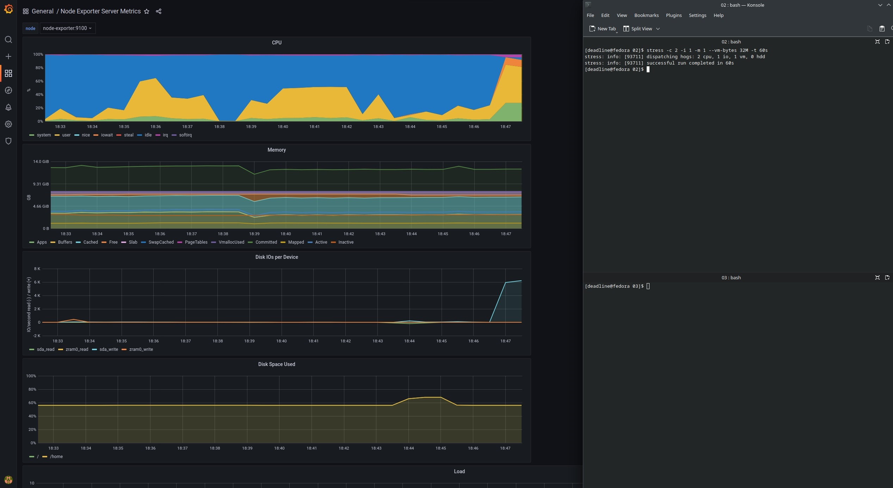
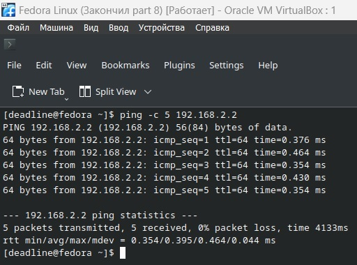
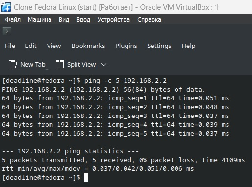
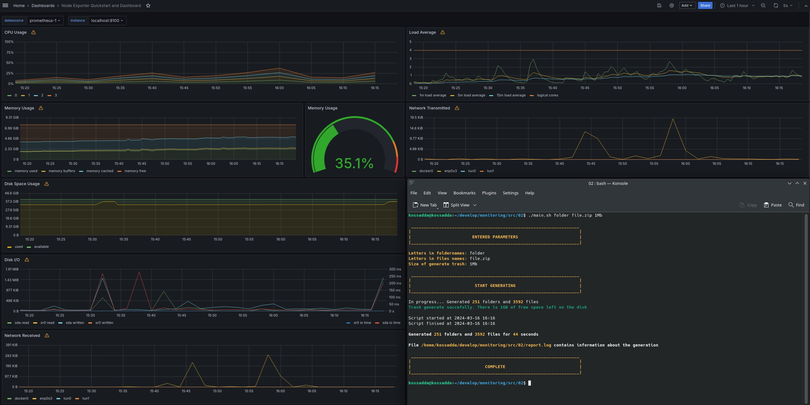
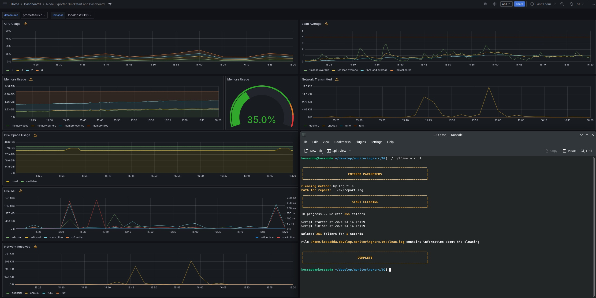
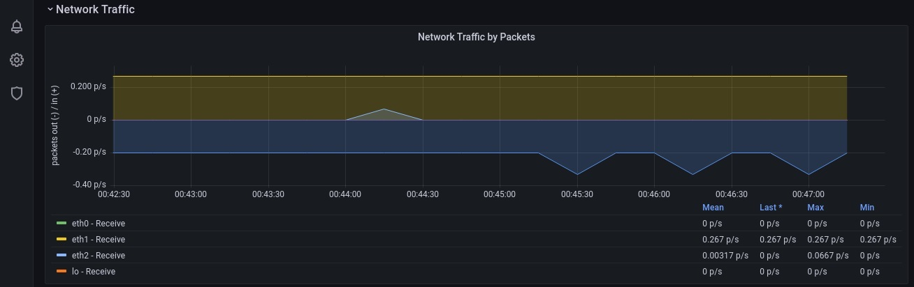

# Part 8. Готовый дашборд

**Установить готовый дашборд Node Exporter Quickstart and Dashboard с официального сайта Grafana Labs**

## Установка Node Exporter

- Загрузить инструмент Node Exporter:

`wget https://github.com/prometheus/node_exporter/releases/download/v1.2.2/node_exporter-1.2.2.linux-amd64.tar.gz`  

- Извлечь файлы:

`tar xvfz node_exporter-1.2.2.linux-amd64.tar.gz`  

- Создать Node Exporter Serve:

`sudo vim /etc/systemd/system/node_exporter.service`  
>[Unit]  
Description=Node Exporter  
Wants=network-online.target  
After=network-online.target  
[Service]  
User=node_exporter  
Group=node_exporter  
Type=simple  
ExecStart=/usr/local/bin/node_exporter  
[Install]  
WantedBy=multi-user.target  

- Перезагрузить systemd и запустить службу Node Exporter:

`sudo systemctl daemon-reload`  
`sudo systemctl start node_exporter`  
`sudo systemctl status node_exporter`  

## Создание собственного dashboard'а

- Перейти на страницу *GrafanaLabs* в категорию *Dashboards* и выбрать из списка *Node Exporter Full*:

- Загрузить файл JSON нажав на *Download JSON*:

- В Grafana в разделе *Dashboards* нажать на кнопку *Import*:

- Копировать содержимое JSON файла в окно *Import via panel json* и нажать *Load*:

**Провести те же тесты, что и в Части 7**

- Создание мусора:

- Очистка мусора:

- Запустить команду stress и посмотреть на нагрузку жесткого диска, оперативной памяти и ЦПУ:

`stress -c 2 -i 1 -m 1 --vm-bytes 32M -t 60s`  

**Связать две виртуальные машины**

**1 машина:** `sudo vim /etc/sysconfig/network-scripts/ifcfg-enp0s8`  
>TYPE=Ethernet  
BOOTPROTO=none  
DEFROUTE=yes  
IPV4_FAILURE_FATAL=no  
IPV6INIT=yes  
IPV6_AUTOCONF=yes  
IPV6_DEFROUTE=yes  
IPV6_FAILURE_FATAL=no  
NAME=enp0s8  
UUID=уникальный_UUID_для_машины_1  
DEVICE=enp0s8  
ONBOOT=yes  
IPADDR=192.168.2.1  
PREFIX=24  
GATEWAY=192.168.2.254  
DNS1=8.8.8.8

`sudo nmcli connection add con-name "enp0s8" ifname enp0s8 type ethernet`  
`sudo nmcli connection add con-name "enp0s8" ifname enp0s8 type ethernet UUID_MACHINE_1=$(uuidgen)`  
`sudo nmcli connection modify enp0s8 ipv4.addresses 192.168.2.1/24 ipv4.gateway 192.168.2.254`  
`sudo nmcli connection modify enp0s8 ipv4.method manual`  
`sudo systemctl restart NetworkManager`  

**2 машина:** `sudo vim /etc/sysconfig/network-scripts/ifcfg-enp0s8`  
>TYPE=Ethernet  
BOOTPROTO=none  
DEFROUTE=yes  
IPV4_FAILURE_FATAL=no  
IPV6INIT=yes  
IPV6_AUTOCONF=yes  
IPV6_DEFROUTE=yes  
IPV6_FAILURE_FATAL=no  
NAME=enp0s8  
UUID=уникальный_UUID_для_машины_2  
DEVICE=enp0s8  
ONBOOT=yes  
IPADDR=192.168.2.2  
PREFIX=24  
GATEWAY=192.168.2.254  
DNS1=8.8.8.8

`sudo nmcli connection add con-name "enp0s8" ifname enp0s8 type ethernet`  
`sudo nmcli connection add con-name "enp0s8" ifname enp0s8 type ethernet UUID_MACHINE_2=$(uuidgen)`  
`sudo nmcli connection modify enp0s8 ipv4.addresses 192.168.2.2/24 ipv4.gateway 192.168.2.254`  
`sudo nmcli connection modify enp0s8 ipv4.method manual`  
`sudo systemctl restart NetworkManager`  

**1 машина:** `ping 192.168.2.1`  

**2 машина:** `ping 192.168.2.2`  

- Запустить тест нагрузки сети с помощью утилиты iperf3

**1 машина:** `iperf3 -c 192.168.2.1`  

**2 машина:** `iperf3 -s`  

- Посмотреть на нагрузку сетевого интерфейса:

