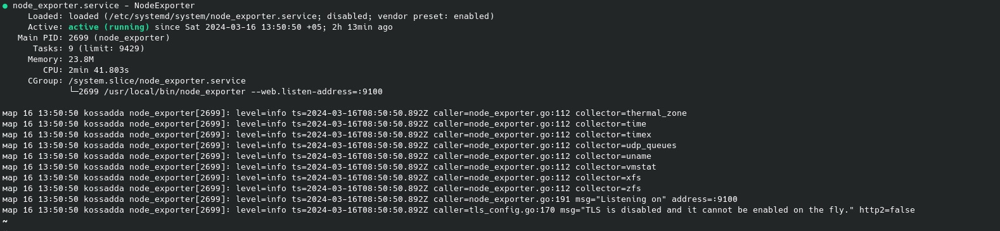

# Part 8. Готовый дашборд

**Установить готовый дашборд Node Exporter Quickstart and Dashboard с официального сайта Grafana Labs**

## Установка Node Exporter

- Загрузить инструмент Node Exporter:

`wget https://github.com/prometheus/node_exporter/releases/download/v1.2.2/node_exporter-1.2.2.linux-amd64.tar.gz`  

- Извлечь файлы:

`tar xvfz node_exporter-1.2.2.linux-amd64.tar.gz`  

- Создать Node Exporter Serve:

`sudo vim /etc/systemd/system/node_exporter.service`  
>[Unit]
Description=Node Exporter
Wants=network-online.target
After=network-online.target
[Service]
User=node_exporter
Group=node_exporter
Type=simple
ExecStart=/usr/local/bin/node_exporter
[Install]
WantedBy=multi-user.target

- Перезагрузить systemd и запустить службу Node Exporter:

`sudo systemctl daemon-reload`  
`sudo systemctl start node_exporter`  
`sudo systemctl status node_exporter`  

## Создание собственного dashboard'а

- Перейти на страницу *GrafanaLabs* в категорию *Dashboards* и выбрать из списка *Node Exporter Full*:

- Загрузить файл JSON нажав на *Download JSON*:

- В Grafana в разделе *Dashboards* нажать на кнопку *Import*:

- Копировать содержимое JSON файла в окно *Import via panel json* и нажать *Load*:

**Провести те же тесты, что и в Части 7**
