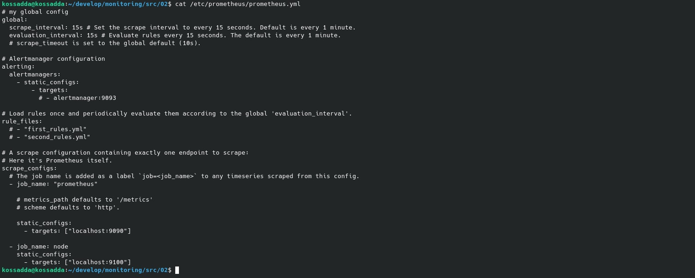
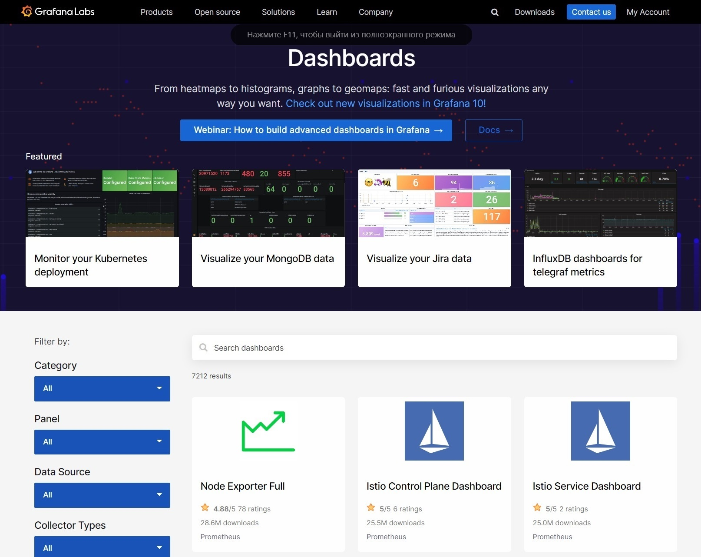
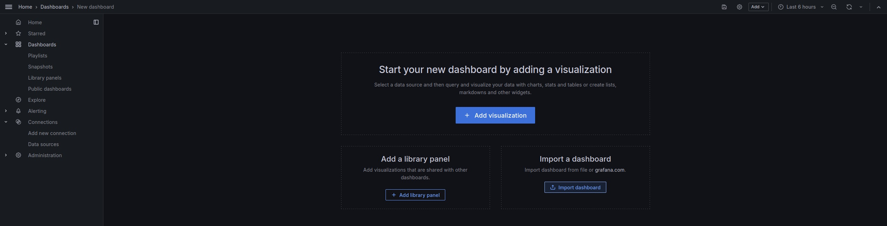
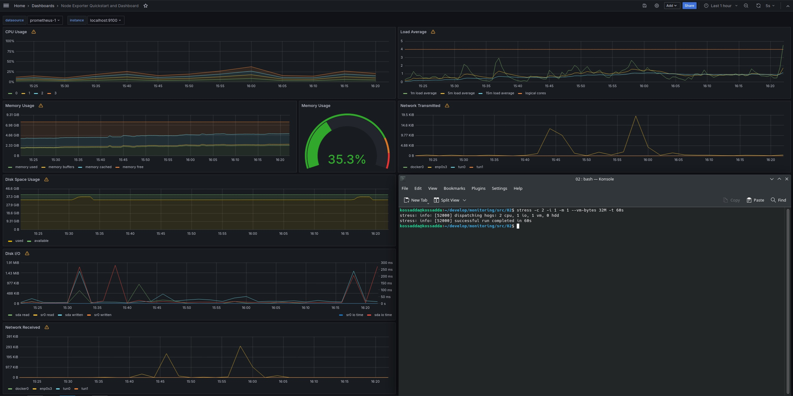
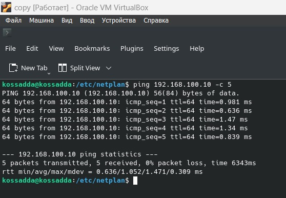

# Part 8. Готовый дашборд

**Установить готовый дашборд Node Exporter Quickstart and Dashboard с официального сайта Grafana Labs**

## Установка Node Exporter

- Загрузить инструмент Node Exporter:

`wget https://github.com/prometheus/node_exporter/releases/download/v1.2.2/node_exporter-1.2.2.linux-amd64.tar.gz`  

- Извлечь файлы:

`tar xvfz node_exporter-1.2.2.linux-amd64.tar.gz`  

- Создать Node Exporter Serve:

`sudo vim /etc/systemd/system/node_exporter.service`  
>[Unit]  
Description=Node Exporter  
Wants=network-online.target  
After=network-online.target  
[Service]  
User=node_exporter  
Group=node_exporter  
Type=simple  
ExecStart=/usr/local/bin/node_exporter  
[Install]  
WantedBy=multi-user.target  

- Перезагрузить systemd и запустить службу Node Exporter:

`sudo systemctl daemon-reload`  
`sudo systemctl start node_exporter`  
`sudo systemctl status node_exporter`  

- Проверить работу порта:

- Добавить Node Exporter в цели Prometheus'а:

- Проверить появились ли метрики Node Exporter в целях Prometheus'а:

## Создание собственного dashboard'а

- Перейти на страницу *GrafanaLabs* в категорию *Dashboards*:

- Выбрать из списка *Node Exporter Quickstart and Dashboard* и загрузить файл JSON нажав на *Download JSON*:

- В Grafana в разделе *Dashboards* нажать на кнопку *Import a dashboard*:

- Копировать содержимое JSON файла или выбрать его нажав *Upload dashboar JSON file* и нажать *Load*:

- Вид готового dashboard'а:

**Провести те же тесты, что и в Части 7**

- Создание мусора:

- Очистка мусора:

- Запустить команду stress и посмотреть на нагрузку жесткого диска, оперативной памяти и ЦПУ:

`stress -c 2 -i 1 -m 1 --vm-bytes 32M -t 60s`  

## Статическая маршрутизация между двумя машинами

**1 машина:** `sudo vim /etc/netplan/00-network-manager-all.yaml`  

**2 машина:** `sudo vim /etc/netplan/00-network-manager-all.yaml`  

**1 машина:** `ping 172.24.116.8 -c 5`  

**2 машина:** `ping 192.168.100.10 -c 5`  

- Для удобства ограничить отображение метрик на dashboard, указав единственный необходимый нам адаптер enp0s9 и провести тест нагрузки сетевого соединения при пинговании второй машины:

