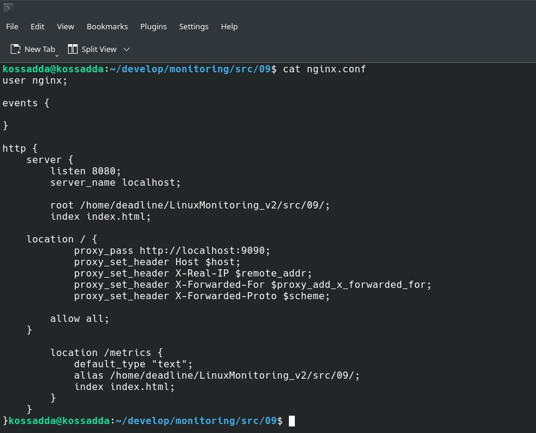
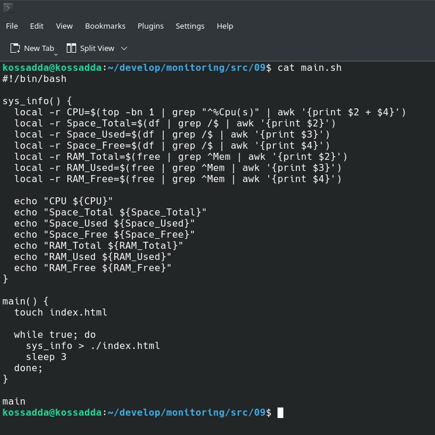
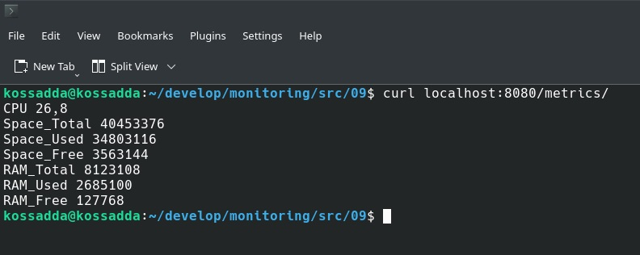
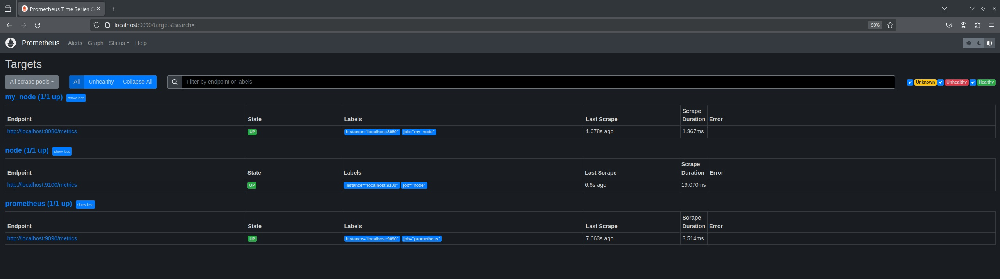
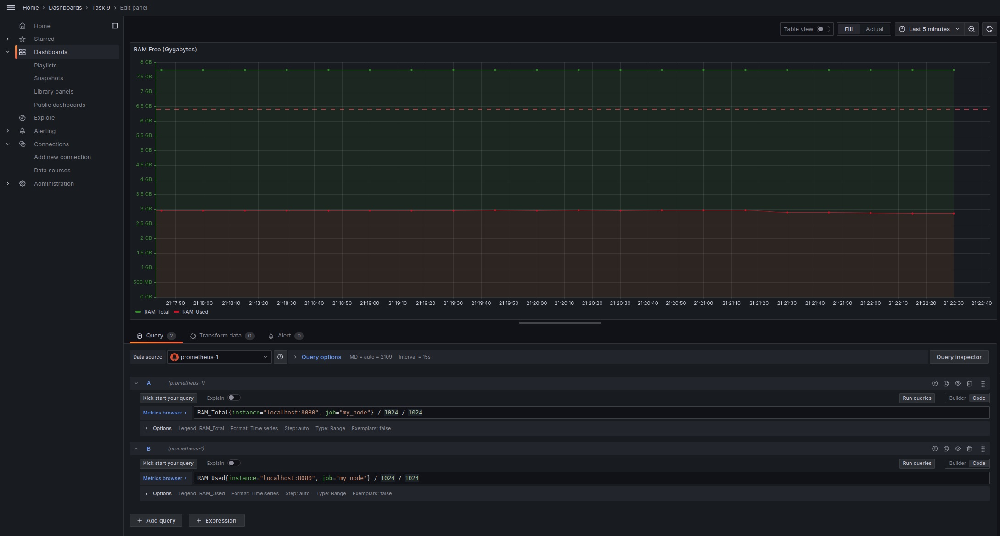

# Part 9. Дополнительно. Свой node_exporter

**Написать bash-скрипт или программу на Си, которая собирает информацию по базовым метрикам системы (ЦПУ, оперативная память, жесткий диск (объем)). Скрипт или программа должна формировать html страничку по формату Prometheus, которую будет отдавать nginx.**  
**Саму страничку обновлять можно как внутри bash-скрипта или программы (в цикле), так и при помощи утилиты cron, но не чаще, чем раз в 3 секунды.**

## Настройка конфигураций

- Создать файл **prometheus.yml** и помимо основных портов (9090 для *Prometheus* и 9100 для *Node Exporter*) создать еще одну рабочую цель под названием *my_node*, работающую на порте 8080:

`sudo vim prometheus.yml`  

- Копировать **prometheus.yml** в системную директорию:

`sudo cp prometheus.yml /etc/prometheus/`  

- Создать файл **nginx.conf**, указать рабочую директорию с будущим html файлом, настроить на прослушивание порта 8080:

`sudo vim nginx.conf`  

- Копировать **nginx.conf** в системную директорию:

`sudo cp nginx.conf /etc/nginx.conf/`  

- Перезапустить службы prometheus.service и nginx.service после внесенных изменений:

`systemctl restart nginx.service`  
`systemctl restart prometheus.service`  

- Создать скрипт собирающий необходимые данные (из **Части 7**) в **index.html** с обновлением данных в 3 секунды:

- После запуска скрипта данные из index.html должны появиться на http://localhost:8080/metrics/:

`curl localhost:8080/metrics/`  

- Если данные успешно считались и prometheus получил сигнал с указанного порта, то в графе **State** у *my_node* будет указано состояние **UP**:

**Провести те же тесты, что и в Части 7**

- Создание мусора:

- Очистка мусора:

- Запустить команду stress и посмотреть на нагрузку жесткого диска, оперативной памяти и ЦПУ:

`stress -c 2 -i 1 -m 1 --vm-bytes 32M -t 60s`  
